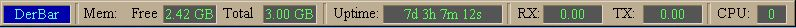

### DerBar - a simple system-status bar

DerBar is a simple, slightly-configurable status bar for monitoring key system and network parameters.  It is modeled on older status-monitoring programs such as StatBar, WinBar, and InfoBar, but without the configuration options of those other programs; it is designed for compactness and compatibility, not for turning parts on and off.  The few configuration options that are present, are accessed via the icon in the system tray.  You can move DerBar anywhere you want, by grabbing it and dragging it around, and it will remember where you leave it next time it runs.  

DerBar is compatible with all other programs and will not conflict with DirectX games, as each of the afore-mentioned tools would sometimes do.  It works fine with WinXP, Vista and later versiona, but I have no idea whether it would work under Win98 or not.

Download [DerBar](https://github.com/DerellLicht/bin/raw/master/DerBar.zip) utility here

DerBar is freeware, source code is available. 
Download [DerBar source code](https://github.com/DerellLicht/derbar) here

DerBar is written in C++, using standard Windows library calls.  It is built using the open source MinGW (Minimal Gnu for Windows) tools, and requires a couple of the common utilities from Cygwin as well (Gnu make, rm, etc).

| Command | Description |
| --- | --- |
| git status | List all new or modified files |
| git diff | Show file differences that haven't been staged |

_Revision history_

| Version | description | 
| --- | --- | 
| 1.00 | Original release 
| 1.01 | Added color options for field colors 
| 1.02 | Added option to select which network interface should be used for
reading network throughput. 
1.03: Add listview to show info for all interfaces 
1.04: Replace interface-selection combo box in Options, with management via
the listview dialog. 
1.05: Add status displays for locking keyboard keys 
1.06: > Add option to move main dialog back to a visible position (to deal
with desktop size changes) 
       > Add option to make main window stay on top 
1.07 > make the memory bars wider, so that 16GB data will display! 
       > try to detect if dialog is off-screen, and move it back onto display 
1.08 > Modify call to PdhGetFormattedCounterValue(), to try to eliminate the
undocumented 0x800007D6 (PDH_CALC_NEGATIVE_DENOMINATOR) Error. 
       > About dialog - convert home website link from button to hyperlink 
1.09 > Move systray functionality to separate file 
       > Integrate ClearIconTray functions to DerBar 1.10 Research into
refresh messages 
1.11 > Add right-click on main dialog, to *also* present the action menu 
       > Fix startup operations so ip_iface tables are build before reading
config file 
       > Store show_winmsgs in INI file 
